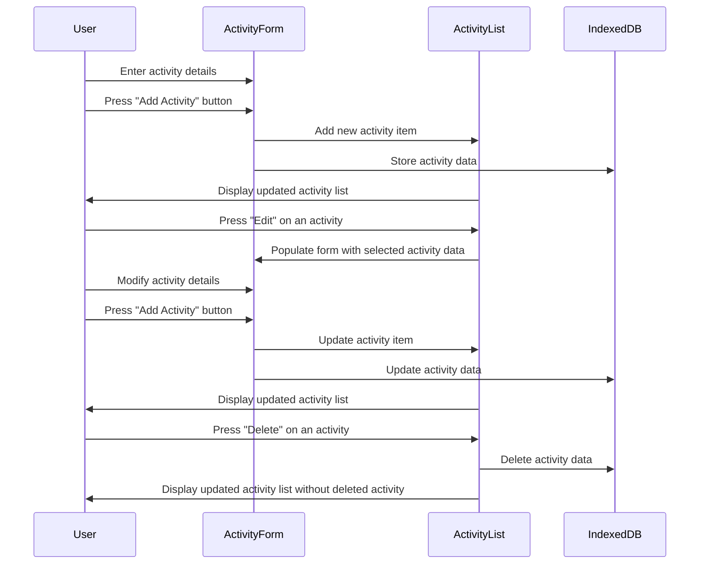

## Activity Form Page Feature

The feature I chose was the **Activity Form Page**.

- The page includes:
  - A form component to **enter new activities**.
  - An **Activity List** container component that stores all the activities entered so far, allowing users to:
    - **Edit** activities
    - **Delete** activities

- Each activity entered is stored in **IndexedDB** for persistent data storage.

### Sequence Diagram

