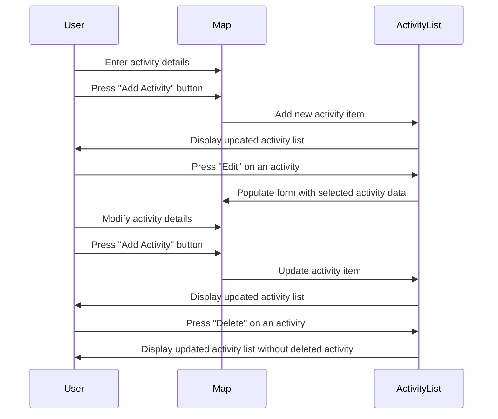

## Itinerary Display Page Feature

The feature I chose was the **Itinerary Display Page** with Emmanuel.

- The page includes:
  - A map component to **visualize the itinerary**.
  - An **activity list** component that shows the activities by day specified via a dropdown
  - Buttons to save, edit, and delete activities

### Sequence Diagram

